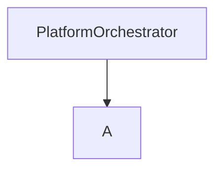

# platforms-clients

the repo, contains all the clients for the different platforms and manages the download of social media metadata and
store it in a database

### Diagram

PlatformOrchestrator
└── initialize_platform_managers()
    └── Creates platform-specific managers (TwitterManager, YoutubeManager)
        └── Each manager creates platform-specific client
            └── Client handles platform API interactions

DatabaseManager
├── Main database (tracks platforms)
└── Platform-specific databases
    └── Stores tasks and collected data


## Adding (collection)tasks

When the program starts (or `check_new_client_tasks`) is called tasks
are loaded from `CLIENTS_TASKS_PATH` (data/clients_tasks)


```
class ClientTaskConfig(BaseModel):
    model_config = {'extra': "allow"}
    id: Optional[int] = None
    task_name: str
    platform: str
    collection_config: list[CollectConfig]
    client_config: Optional[ClientConfig] = None
    #
    status: CollectionStatus = CollectionStatus.INIT
    time_added: Optional[datetime] = None
    steps_done: Optional[int] = -1
    #
    current_step_config: Optional[CollectConfig] = None
```

## Abstract client

### setup

    Setup the client. This might already connect with the service in order to obtain a session cookie or something similar.

### transform_config


### add_tasks

### continue_tasks

### continue_task

### collect

### default_post_data

### create_post_entry

This function transforms the service specific post entry into a DBPost object

### create_user_entry

    

## Youtube

### How to obtain a API key

## TikTok

###
https://developers.tiktok.com/

