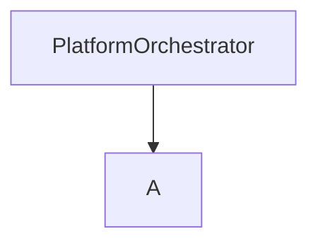

# platforms-clients

the repo, contains all the clients for the different platforms and manages the download of social media metadata and
store it in a database.

# Installation

git clone <this_repo>


1. 
uv sync

2.
install optional dependencies based on the platform you want to use
uv sync -e <platform>
for now there is youtube, twitter, tiktok

copy template.env and name the new file: .env

and comment in the lines for the platforms you want to use.

3.
run `typer main.py run init`


## Running commands

Running commands with Typer:

first source run.sh to have the projects it depends on for the PYTHONPATH

commands:

- status: Gives a status on the defined databases (in the RUN_CONFIG)
- collect: Collect with the current RUN_CONFIG
- db-stats: Get the stats post-count per month/day

### Diagram

PlatformOrchestrator
└── initialize_platform_managers()
└── Creates platform-specific managers (TwitterManager, YoutubeManager)
└── Each manager creates platform-specific client
└── Client handles platform API interactions

DatabaseManager
├── Main database (tracks platforms)
└── Platform-specific databases
└── Stores tasks and collected data



## Adding (collection)tasks

When the program starts (or `check_new_client_tasks`) is called tasks
are loaded from `CLIENTS_TASKS_PATH` (data/clients_tasks)

```
class ClientTaskConfig(BaseModel):
    model_config = {'extra': "allow"}
    id: Optional[int] = None
    task_name: str
    platform: str
    collection_config: list[CollectConfig]
    client_config: Optional[ClientConfig] = None
    #
    status: CollectionStatus = CollectionStatus.INIT
    time_added: Optional[datetime] = None
    steps_done: Optional[int] = -1
    #
    current_step_config: Optional[CollectConfig] = None
```

## Abstract client

### setup

    Setup the client. This might already connect with the service in order to obtain a session cookie or something similar.

### transform_config

### add_tasks

### continue_tasks

### continue_task

### collect

### default_post_data

### create_post_entry

This function transforms the service specific post entry into a DBPost object

### create_user_entry

## Youtube

### How to obtain a API key

## TikTok

###

https://developers.tiktok.com/

The Client is a fork of the official
client [TikTok Research API Wrapper](https://github.com/tiktok/tiktok-research-api-wrapper).
Repo of the form: https://github.com/transfluxus/tiktok-research-api-wrapper

Because different errors should be handled differently and the sleep-timer when waiting for the SearchID reusable needs
to be adjusted.
It should be more or less 7 seconds, it seems.

Use
`pip install -U  -I git+https://github.com/transfluxus/tiktok-research-api-wrapper.git#subdirectory=tiktok-research-api-python`

maybe
`pip install -U -I  --no-deps git+https://github.com/transfluxus/tiktok-research-api-wrapper.git#subdirectory=tiktok-research-api-python`

